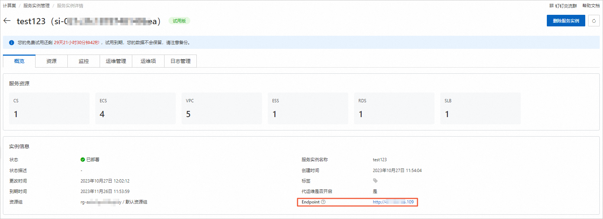
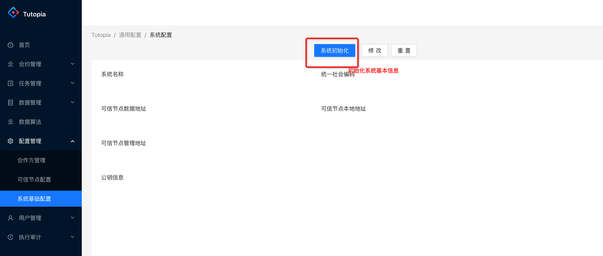
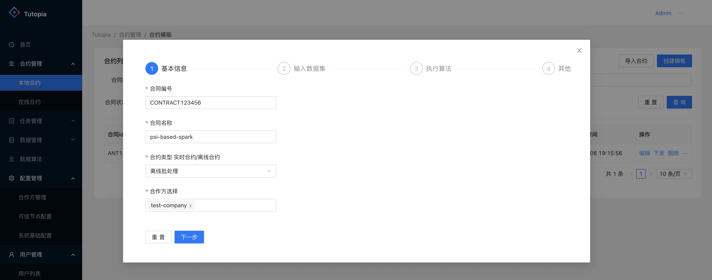
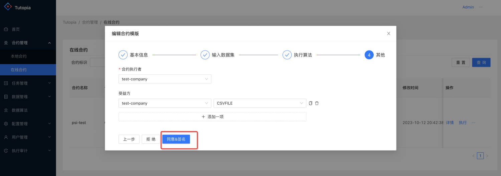
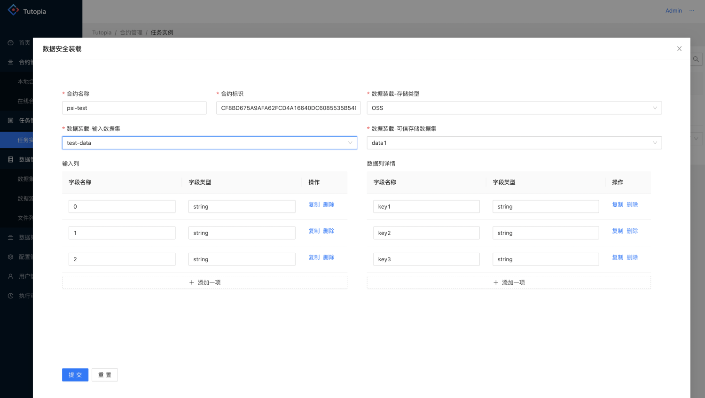
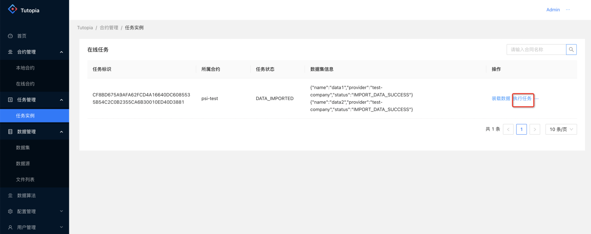

# 机密计算数据协作平台部署文档

## 概述

基于Occlum+Spark实现的大数据分布式机密计算服务

目前机密计算数据协作云平台处于**免费**试用阶段，欢迎大家申请试用，期间发现任何问题也欢迎反馈交流。

## 计费说明

机密计算云平台在计算巢上的费用主要涉及：

- ACK Worker 节点规格
- ACK Worker 节点系统盘类型及容量
- 数据库类型及规格
- 阿里云OSS资源

计费方式包括：

- 按量付费（小时）
- 包年包月

目前提供如下实例：

| Worker 节点规格                                | Worker 节点系统盘大小 | Worker 节点系统盘磁盘类型 | MySQL 实例系列 | MySQL 实例规格 | MySQL 实例磁盘大小 | MySQL 实例存储类型 |
|--------------------------------------------| --- | --- | --- | --- | --- | --- |
| ecs.g7t.4xlarge 安全增强通用型 g7t, 32vCPU 128GiB | 60BiB | ESSD云盘 | 基础版 | mysql.n2.medium.1, 2vCPU 4GiB | 30GiB | ESSD云盘 |

预估费用在创建实例时可实时看到。
如需更多规格、其他服务（如集群高可用性要求等），可使用自定义规格。

## 部署流程

### 前置条件

- RAM账号所需权限: 机密应用云平台服务需要对ACK、ECS、VPC等资源进行访问和创建操作，若您使用RAM用户创建服务实例，需要在创建服务实例前，对使用的RAM用户的账号添加相应资源的权限。添加RAM权限的详细操作，请参见[为RAM用户授权](https://help.aliyun.com/document_detail/121945.html)。所需权限如下表所示。

| --- | --- |
| 权限策略名称                      | 备注                                    |
|---------------------------------|---------------------------------------|
| AliyunCSFullAccess              | 管理容器服务(CS)的权限             |
| AliyunECSFullAccess             | 管理云服务器服务（ECS）的权限             |
| AliyunVPCFullAccess             | 管理专有网络（VPC）的权限                 |
| AliyunRDSFullAccess             | 管理云数据库服务(RDS)的权限               |
| AliyunROSFullAccess             | 管理资源编排服务（ROS）的权限             |
| AliyunComputeNestUserFullAccess | 管理计算巢服务（ComputeNest）的用户侧权限  |
| AliyunCloudMonitorFullAccess    | 管理云监控（CloudMonitor）的权限          |

### 部署步骤

1. 进入服务实例部署页面，您可以在阿里云计算巢自行搜索，也可以通过该 [部署链接](https://computenest.console.aliyun.com/service/detail/cn-hangzhou/service-26e761eeff0c481184f9/4?type=user&isRecommend=true) 快速到达。

2. 填写申请试用的表单，在审核通过后，就可以创建机密应用云平台服务。

3. 根据服务实例创建的界面提示，填写参数并提交部署。

### 部署参数说明

您在创建服务实例的过程中，需要配置服务实例的参数，各参数说明如下：

| 参数项      | 示例                       | 说明                           |
|----------|--------------------------|------------------------------|
| 服务实例名称   | test                     | 实例的名称                        |
| 地域       | 华北1（杭州）                  | 选中服务实例的地域，建议就近选中，以获取更好的网络延时。 |
| 可用区      | 可用区K                     | 地域下的不同可用区域，确保实例非空。           |
| MYSQL配置  | mysql用户名和密码              | MYSQL的登录账号和密码。               |
| OSS配置    | endpoint, bucket, ak, sk | 用户需要提前申请阿里云OSS资源。            |
| 数据协作本地名称 | my-company               | 设置本地协作名称，用于初始化本地tutopia系统使用。 |

### 验证结果

1. 进入 **服务实例详情页** ，可以在 **部署日志** 中查看服务实例部署过程，部署时间大约需要 15 分钟。部署完成后，可以在 **概览** 中看到部署状态为 **已部署**。
2. 部署完成后，进入 **服务实例详情页**，可以在 **概览-实例信息-Endpoint** 获取到服务的访问地址，点击该地址即可访问机密应用云平台。

## 使用机密应用云平台

### 

1. 点击 **服务实例详情页-概览-实例信息-Endpoint** 进入机密应用云平台。
   

2. 在登录页面输入用户名密码， 默认的用户名密码为 Admin/123456。
   

3. 登录成功后，进入 tutopia 管理页面，在 **配置管理-系统基础配置** 页面中，点击 **系统初始化** 按钮。
   

4. 创建数据协作合约， 在 **合约管理-本地合约** 页面中，点击 **创建模版** 按钮。
   

5. 签名合约达成业务合作共识， 在 **合约管理-在线合约** 页面中，点击 **详情** 按钮，查看合约详情和签名
   

6. 上传数据，在 **任务管理-任务实例** 页面中，点击 **装载数据** 按钮，装载数据
   

7. 执行任务，在 **任务管理-任务实例** 页面中，点击 **执行任务** 按钮，装载数据
   

   